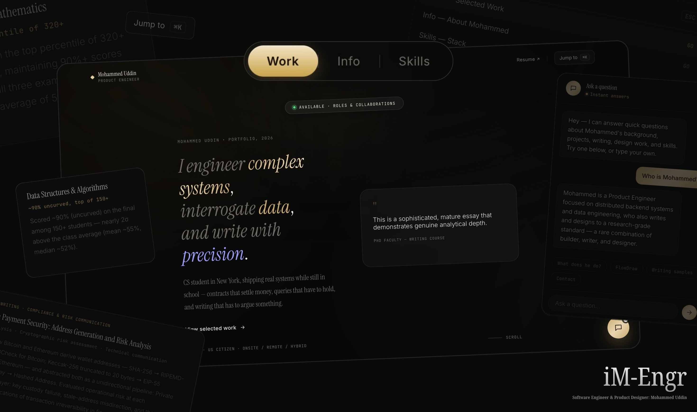
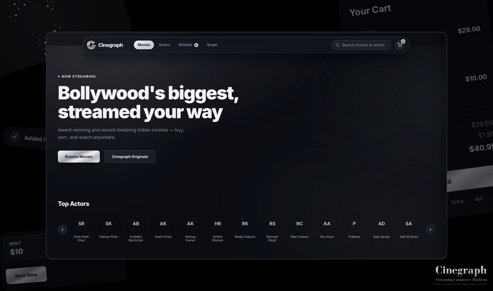

  <h1>UI/UX, Product & Visual Design</h1>

### [Personal Website / Portfolio — iM-Engr](https://im-engr474-sep26sys.netlify.app)

**iM-Engr** combines high-end editorial typography with modern, minimal product design. The experience also features a deterministic, client-side conversational retrieval system built without AI or external services.

  

### [Full-Stack Application — Cinegraph](#)

**Cinegraph** showcases both product design and full-stack engineering: a deliberately iterated visual design system (typography, color, motion, accessibility) paired with a complete application stack –– REST + GraphQL APIs, a relational database with transactional integrity, and third-party API integration with a secure backend proxy pattern.

[View more examples of **Full-Stack Applications**.](https://github.com/cryp-moh-graphy/fullstack-product-design)

  

